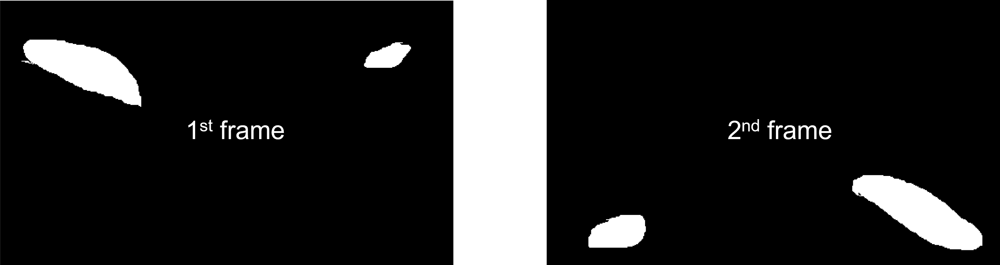
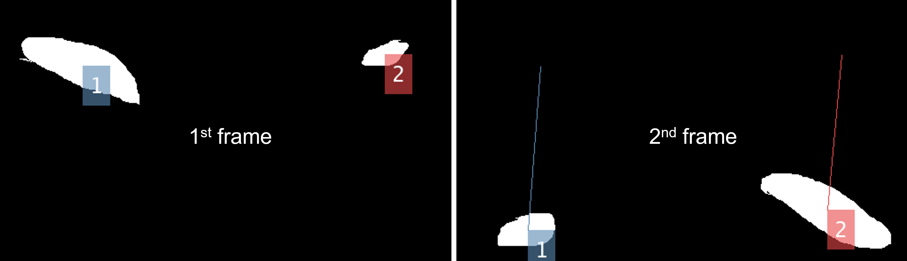
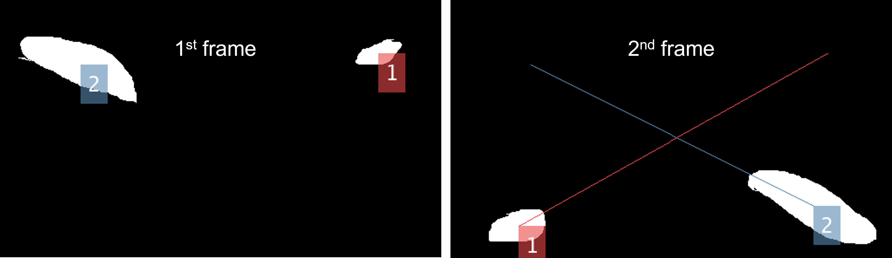

# CellTracker: Easy to track single cell motion


Segment and track particles in MATLAB.

<!-- GETTING STARTED -->
## Getting Started

### Prerequisites

- __Matlab__

- __Computer Vision Toolbox__ ('Home' --> 'Add-Ons') to visualize trajectories.

- (optional) __Image Processing Toolbox__ ('Home' --> 'Add-Ons') to load GUI.

- (optional) __[Nd2SdkMatlab](https://github.com/tytghy/Nd2SdkMatlab/)__ to read `.nd2` file.

### Installation Options

1. Install with [`git`](https://git-scm.com/)

    ```sh
    git clone https://github.com/tytghy/CellTracker.git
    ```

2. Download ZIP from [CellTracker](https://github.com/tytghy/CellTracker) and unzip the files.  

## Usage

1. Read the image in MATLAB using Nd2SdkMatlab.
2. Binarize the image with `bwgui`.
3. Trace the binarized paritcles.

> See **[Example](#example)**.

## Example

Follow the steps below to trace the sample particles.

```matlab
%% Load image
filename = 'G:\fluorescentCells.nd2';
img = nd2read(filename,1:100); % can't read tif for updated nd2sdkmatlab.

%% Binarize image
% use image binarizer; load \sample\img.mat
% export the image using 'Generate bw'
bwgui(img);

% or export the binarization parameters using 'Generate Para' and uncomment code below
% for batch processing
% bw = bwfun(@(x) getbw(x, bwPara), img);

%% Track particles 
% load \sample\bw.mat
[traj] = trackbw(bw);
trajFiltered = trajfilter(traj, 50);

%% Visualize trajectories
movie = trajmovie(trajFiltered, bw);
implay(movie);
```

## Functions

### File

| Functions | Description | Usage |
| ----------- | ----------- | -------|
| `nd2read` | Read `.nd2` file.   | `img = nd2read(filename, 1:10)`.  See [`Nd2SdkMatlab`](https://github.com/tytghy/Nd2SdkMatlab) for more details.
| `imread` | Built-in function to read files of other format.| `img = imread(filename, 1)`

### Image Binarization

| Function | Description | Usage |
| ----------- | ----------- | ----|
| `bwgui` | Image Binarizer.  The image is filtered by bandpass filter, Gaussian filter and thresholded with adaptive binarization, followed by the removal of small objects (noise).  | `bwgui(img)`|


> __Note__
>
> - `Preview` applies the current parameters and preview the binarized result.
> - `Preview Video` applies the current parameters and preview the first 10 binarized images.
> - `Generate Para` exports the current parameters to the workspace.
> - `Generate bw` applies the current parameters and exports the binarized image sequence to the workspace.
>
> Exported parameters `bwPara` and binarized image sequences `bw` have different indexes to avoid overwrite.  

For batch binarization with the same parameters, first export the parameters with `Generate Para`.  Then use `bw = bwfun(@(x) getbw(x, bwPara), img)`.

### Tracking

The tracking algorithm is inspired by [TrackMate](https://imagej.net/plugins/trackmate/algorithms) and [the Jaqaman paper](https://doi.org/10.1038/nmeth.1237).  Basically, it tracks the movement of points by minimizing the total changes in distance, a typical example of [linear assignment problem](https://en.wikipedia.org/wiki/Assignment_problem) that is solved by a built-in function `matchpairs`.

| Functions | Description | Usage|
| ----------- | ----------- | --|
| `trackbw` | Track the binarized image sequence.| `traj = trackbw(bw)`|

> Completed syntax of `trackbw`:
>
>   ```matlab
>    traj = trackbw(bw, maxDistAllowed, features, featureWeight, performGapClosing, maxGapAllowed, maxTimeGap)
> ```

| Parameters | Description | Default|
| ----------- | ----------- |---|
| `maxDistAllowed`| Maximum allowed displacement between two frames. | `20` (px)|
| `feature`| Features to be weighted. | `{}`. Available features include 'Area', 'MajorAxisLength'.|
| `featureWeight`| Weights of features. | `[]` |
| `performGapClosing`| Whether perform gap closing (or linking) or not. | `false` |
| `maxGapAllowed`| Maximum allowed traj. gap distance. | `10` (px)|
| `maxTimeGap`| Maximum allowed time gap. | `2` (frames)|

> __Note__
>
> - The weight of the feature, referred to [TrackMate](https://imagej.net/plugins/trackmate/algorithms), is defined as the three times of the relative difference, i.e.,
> $$ 3×weight×{|p1−p2|\over p1+p2} $$
> where $p1$ and $p2$ are the feature values such as cell lengths.

For instance, a movie includes two cells with different length.



The program links the cells with the cloest distance if no weight is applied.

```matlab
    traj = trackbw(bw, 1000);
```



The program links the cells based on their distance and long axis length (or area) if a suitable weight is applied.

```matlab
    traj = trackbw(bw, 1000, {'MajorAxisLength'}, 2);
```



### Trace Filter

| Function | Description | Usage|
| ----------- | ----------- | ---|
| `trajfilter` | Filter out traces of length shorter than `len`. |`traj = trajfilter(traj, len)`|

### Trace Visualizer

| Function | Description | Usage |
| ----------- | ----------- | --|
| `trajmovie` | Create a RGB movie showing raw image sequence and comet-like traj. overlaid.| `movie = trajmovie(traj, imgSequence)`|

> __Note__
>
> One can also visualize the index of each traj. by applying __Examine Mode__.  Just add `ture` or `1` to the input argument.
>
> `movie = trajmovie(traj, imgSequence, 1)`
>
> Rendering the indexes is time-consuming.
>
> The colors of traj. are chosen from [`linspecer`](https://www.mathworks.com/matlabcentral/fileexchange/42673-beautiful-and-distinguishable-line-colors-colormap).

## References

- Tinevez, J.-Y. *et al*. TrackMate: An open and extensible platform for single-particle tracking. *Methods* __115__, 80–90 (2017). [https://doi.org/10.1016/j.ymeth.2016.09.016](https://doi.org/10.1016/j.ymeth.2016.09.016)

- Jaqaman, K. *et al*. Robust single-particle tracking in live-cell time-lapse sequences. *Nat Methods* __5__, 695–702 (2008). [https://doi.org/10.1038/nmeth.1237](https://doi.org/10.1038/nmeth.1237)

## Acknowledgements

- The project is inspired by [TrackMate Algorithms](https://imagej.net/plugins/trackmate/algorithms) and [the Jaqaman paper](https://doi.org/10.1038/nmeth.1237).  
- Thank Ye Li for the fast labelling trajectory algorithm.

See more:

- [TrackMate Algorithms](https://imagej.net/plugins/trackmate/algorithms)
- [Nd2SdkMatlab](https://github.com/tytghy/Nd2SdkMatlab) to read `.nd2` file
- [Linear Assignment Problem](http://www.assignmentproblems.com/linearAP.htm)
- [Linspecer](https://www.mathworks.com/matlabcentral/fileexchange/42673-beautiful-and-distinguishable-line-colors-colormap) to craft nice colors
- [Paticle/Cell tracking (Matlab)](https://github.com/JacobZuo/Tracking) to track cell based on Voronoi diagram

## License

This project is licensed under the terms of the [MIT](/LICENSE).
