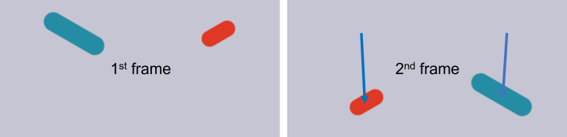
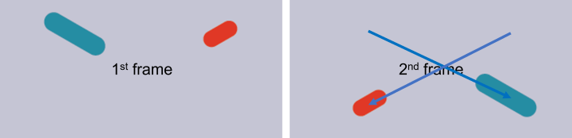

# CellTracker: Easy single cell motion tracking


CellTracker is a user-friendly MATLAB tool for tracking particles in image sequences.

## Features

- Track particles across frames using a linear assignment algorithm
- Visualize trajectories as comet-like trails overlaid on the original image sequence

<!-- GETTING STARTED -->
## Getting Started

### Prerequisites

- __Matlab__

- __Computer Vision Toolbox__ (install via 'Home' --> 'Add-Ons') for trajectory visualization.

- (optional) __Image Processing Toolbox__ (install via 'Home' --> 'Add-Ons') for image segmentation (requires [ImageBinarizer](https://github.com/tytghy/ImageBinarizer)).

- (optional) __[Nd2Matlab](https://github.com/tytghy/Nd2SdkMatlab/)__ for reading `.nd2` file .

### Installation 

1. Install using [`git`](https://git-scm.com/)

    ```sh
    git clone https://github.com/tytghy/CellTracker.git
    ```

2. Or download the ZIP from [CellTracker](https://github.com/tytghy/CellTracker) and unzip it.  

## Usage

1. Load the image sequence into MATLAB (e.g., using __[Nd2Matlab](https://github.com/tytghy/Nd2SdkMatlab/)__ or `imread`).
2. Binarize the image.
3. Track the binarized particles using the `trackbw` function.
4. (Optional) Filter the trajectories using `trajfilter`.
5. Visualize the trajectories using `trajmovie`.

## Example

```matlab
% Load image
% filename = 'G:\fluorescentCells.nd2';
% img = nd2read(filename, 1:100);

% Binarize image using ImageBinarizer
% bwgui(img);

% Track particles
% load sample\bw.mat
[traj] = trackbw(bw);
trajFiltered = trajfilter(traj, 50);

% Visualize trajectories
movie = trajmovie(trajFiltered, bw);
implay(movie);
```

## Functions

CellTracker provides a set of functions for tracking, filtering, and visualization.

### Tracking

The tracking algorithm is inspired by [TrackMate](https://imagej.net/plugins/trackmate/algorithms) and [the Jaqaman paper](https://doi.org/10.1038/nmeth.1237). It tracks the movement of points by minimizing the total changes in distance, solving the [linear assignment problem](https://en.wikipedia.org/wiki/Assignment_problem) using the built-in `matchpairs` function .

| Functions | Description | Usage|
| ----------- | ----------- | --|
| `trackbw` | Track particles in the binarized image sequence.| `traj = trackbw(bw)`|

> Full syntax of `trackbw`:
>
>   ```matlab
>    traj = trackbw(bw, maxDistAllowed, features, featureWeight, performGapClosing, maxGapAllowed, maxTimeGap)
> ```

| Parameter | Description | Default|
| ----------- | ----------- |---|
| `maxDistAllowed`| Maximum allowed displacement between two frames. | `20` (px)|
| `feature`| Features to be weighted. | `{}`. Available features: 'Area', 'MajorAxisLength'.|
| `featureWeight`| Weights of features. | `[]` |
| `performGapClosing`| Whether to perform gap closing (linking) or not. | `false` |
| `maxGapAllowed`| Maximum allowed trajectory gap distance. | `10` (px)|
| `maxTimeGap`| Maximum allowed time gap. | `2` (frames)|

> __Note__
>
> The weight of a feature is defined as three times the relative difference:
>
>  $$ 3×weight×{|p1−p2|\over p1+p2} $$
>
> where $p1$ and $p2$ are the feature values (e.g., cell lengths).

Consider a movie containing two cells of different lengths:


If no weight is applied, the program links the cells based on the closest distance:

```matlab
    traj = trackbw(bw, 1000);
```



However, if a suitable weight is applied, the program links the cells based on both their distance and long axis length (or area):

```matlab
    traj = trackbw(bw, 1000, {'MajorAxisLength'}, 2);
```



By incorporating the long axis length (or area) as a weighted feature, the tracking algorithm can more accurately link cells across frames, even when they have different sizes or shapes.

### Trajectory Filtering

| Function | Description | Usage|
| ----------- | ----------- | ---|
| `trajfilter` | Filter out trajectories shorter than the specified length. |`traj = trajfilter(traj, len)`|

### Trajectory Visualization

| Function | Description | Usage |
| ----------- | ----------- | --|
| `trajmovie` | Create a RGB movie showing the raw image sequence with comet-like trajectories overlaid.| `movie = trajmovie(traj, imgSequence)`|

> __Note__
>
> To visualize the index of each trajectory (Examine Mode), add true or 1 as the third argument:
>
> ```matlab
>   movie = trajmovie(traj, imgSequence, 1)
> ```
>
> Note that rendering the indexes is time-consuming. The colors of the trajectories are chosen from [`linspecer`](https://www.mathworks.com/matlabcentral/fileexchange/42673-beautiful-and-distinguishable-line-colors-colormap).

## References

- Tinevez, J.-Y. *et al*. TrackMate: An open and extensible platform for single-particle tracking. *Methods* __115__, 80–90 (2017). [https://doi.org/10.1016/j.ymeth.2016.09.016](https://doi.org/10.1016/j.ymeth.2016.09.016)

- Jaqaman, K. *et al*. Robust single-particle tracking in live-cell time-lapse sequences. *Nat Methods* __5__, 695–702 (2008). [https://doi.org/10.1038/nmeth.1237](https://doi.org/10.1038/nmeth.1237)

## Acknowledgements

- The project is inspired by [TrackMate Algorithms](https://imagej.net/plugins/trackmate/algorithms) and [the Jaqaman paper](https://doi.org/10.1038/nmeth.1237).  
- Thank Ye Li for the fast labelling trajectory algorithm.

See more:

- [TrackMate Algorithms](https://imagej.net/plugins/trackmate/algorithms)
- [Nd2Matlab](https://github.com/tytghy/Nd2Matlab) for reading `.nd2` file
- [Linear Assignment Problem](http://www.assignmentproblems.com/linearAP.htm)
- [Linspecer](https://www.mathworks.com/matlabcentral/fileexchange/42673-beautiful-and-distinguishable-line-colors-colormap) to craft nice colors
- [Paticle/Cell tracking (Matlab)](https://github.com/JacobZuo/Tracking) to track cell based on Voronoi diagram

## License

This project is licensed under the terms of the [MIT](/LICENSE).
